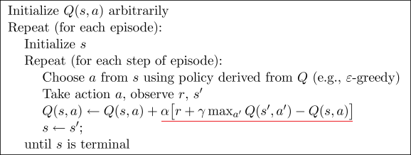
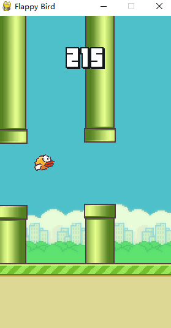

# FlappyBird-RL
Flappy Bird using Reinforcement Learning.

使用Q-learning学习如何玩FlappyBird

### Result

- 迭代18000次，最高得分是：7368分

- 迭代19000次，最高分是：15836分

- 迭代接近20000次时，最高分能达到280000分

### 如何运行

代码主要分为3个文件：

- flappy_bird_env.py : 已封装好的游戏环境。接口格式模仿gym中环境模块的风格
- q_learning.py : Q-learning算法的实现
- train_flappy: 运行主文件。训练时建议 `RENDER` 设为 `FLASE` ，因为可视化环境比较耗费时间。不训练的话可以选择加载已训练好的 `q_table` 数据，即可看到经过训练后游戏运行的效果

### Q-learning

如果不熟悉Q-learning可以浏览这篇博客 [强化学习入门4—Q-learning和Sarsa](https://blog.csdn.net/sherlocksy/article/details/119461043)

算法简介：

### 游戏截图

### Reference

- The FlappyBird Enviroment Fork from [sourabhv/FlapPyBird: A Flappy Bird Clone using python-pygame (github.com)](https://github.com/sourabhv/FlapPyBird)
- 环境参考了 [anthonyli358/FlapPyBird-Reinforcement-Learning: Exploration implementing reinforcement learning using Q-learning in Flappy Bird. (github.com)](https://github.com/anthonyli358/FlapPyBird-Reinforcement-Learning) 

