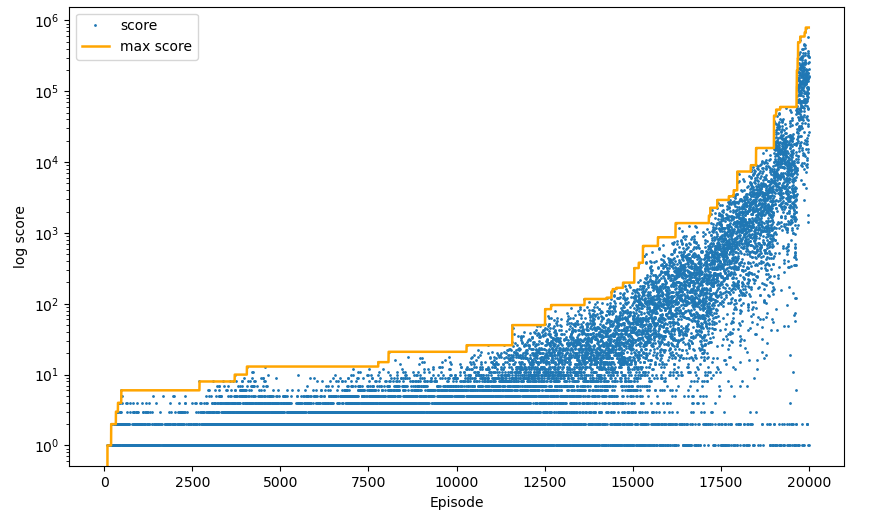

# FlappyBird-RL
Flappy Bird using Reinforcement Learning.

使用Q-learning学习如何玩FlappyBird。

### 如何运行

项目主要分为3个文件：

- flappy_bird_env.py : 已封装好的游戏环境。接口格式模仿gym中环境模块的风格。渲染游戏时可以自定义是否开启游戏音效`turn_on_sound=True`。
- q_learning.py : Q-learning算法的实现
- train_flappy: 运行主文件。训练时建议 `RENDER` 设为 `FLASE` ，因为可视化环境比较耗费时间。不训练的话可以选择加载已训练好的 `q_table` 数据，即可看到经过训练后游戏运行的效果

运行环境：

1. python 3.x

2. Install pipenv

   ````python
   pip install pipenv
   ````

3. Install PyGame 1.9.x 

   ```python
   pip install pygame 
   ```

4. clone this repo

   ```
   git clone https://github.com/sherlockHSY/FlappyBird-RL.git
   ```

5. run `train_flappy.py`

### Result

- 训练18000次时，最高得分是：7368分
- 训练19000次时，最高得分是：15836分
- 训练20000次时，最高得分是：795010分

训练20000次的结果：



已训练好的 `Q table` 数据已保存在 `data` 文件夹下

### Q-learning

算法简介：


如果不熟悉Q-learning可以浏览这篇博客 [强化学习入门4—Q-learning和Sarsa](https://blog.csdn.net/sherlocksy/article/details/119461043)

### 游戏截图


### Reference

- 环境的搭建基于 [sourabhv/FlapPyBird: A Flappy Bird Clone using python-pygame (github.com)](https://github.com/sourabhv/FlapPyBird)
- 环境和算法部分参考了 [anthonyli358/FlapPyBird-Reinforcement-Learning: Exploration implementing reinforcement learning using Q-learning in Flappy Bird. (github.com)](https://github.com/anthonyli358/FlapPyBird-Reinforcement-Learning) 

